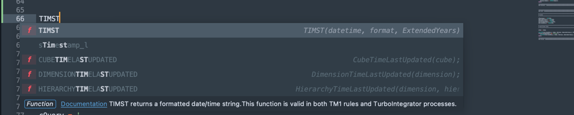
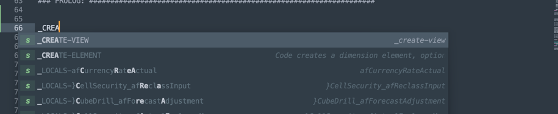

# Pelle TM1

Pelle TM1 is a full-featured Turbo Integrator Process and Rule Editor for TM1 Planning Analytics built on top of [Sublime Text 4](https://www.sublimetext.com)

## Features

### Direct TM1/Planning Analytics Integration

Pelle uses the TM1 REST API for a direct integration with your remote TM1 environment. There are commands to retrieve and push both rule and turbo integrator updates directly to the TM1 server, you can perform all code-intensive updates all from Pelle. 

You can also run Turbo Integrator processes right from Pelle, watch its progress, and even view the relevant tm1server.log entries and TM1ProcessError files automatically right from the sidebar.

### Rule and Turbo Integrator Auto Complete

Pelle comes equipped with the full set of functions used in both Turbo Integrator. They can be easily accessed using Sublime's auto-complete features. Save time by lettings Pele auto-fill the appropriate parameters for a given function, and will even provide a link to the IBM documentation.

Pelle will help you build your complex rule DB() statements, and TI cellget/put/increment functions by populating the appropriate dimensions.

### Syntax Checking

Pelle will leverage the syntax checking features of the TM1 API to let you know on update if there are any issues with your rule or process. It will highlight the relevant row, and provide a message to help you fix errors.

### TI Process Auto Format

Pelle helps to ensure that all code in your TM1 environment has a consistent look and feel. It will automatically format your Turbo Integrator processes, ensuring they have consistent indentation, case, and whitespace. 

### Advanced Completions

Pelle has a bunch of built-in completions for common actions performed within TI processes. This includes:

- Creating views, zeroing out cubes, assigning as cube views as a datasource
- Dimension and hierarchy manipulation
- Iterating through files, cubes, dimensions, 
- Setting up different datasources like ASCII, ODBC, or Cube View

### TM1Top Thread Viewer and Killer

Easily view the current state of your TM1 server. See all the currently running threads, and even stop a server thread right from Pelle.

## Installation

- Pelle can be installed via Package Control [Here](https://packagecontrol.io/installation)
- Instructions on how to use Package Control [here](https://packagecontrol.io/docs/usage)
- Install the 'TM1 Planning Analytics Developer Tools' package from Package Control
- On the TM1 server, the REST API must be enabled, instructions [Here](https://www.ibm.com/support/knowledgecenter/en/SSD29G_2.0.0/com.ibm.swg.ba.cognos.tm1_inst.2.0.0.doc/t_ug_cxr_odata_config.html)

## Usage

### Setting up your project

First things first, we need to setup a Sublime Project for your TM1 environment. 

- Open up Sublime Text so you have blank text input window
- Open up the Command Palette (CMD-SHIFT-P on mac, CTRL-SHIFT-P on windows) and enter 'tm1 config'.  
 
- Select 'TM1: Config - Create New TM1 Project'
- Follow the steps to add in the connection parameters for your remote TM1 server. 
- At the end, you will be prompted to confirm your selections. Select 'Yes' if they're correct. If there as an error, press 'escape' and start over.  

If everything is correct, you will see a Sidebar with your project name containing a .sublime-project file

### Populate Rules and Processes from Remote Server

- Open the command palette, and enter 'tm1 get'  

- Select 'TM1: Get - Pull Objects From Server'. This will connect to the remote server and pull all Rules and Process files. They will be placed in sub-folders within your project   

### Edit Rules and Processes

- To edit rules and processes, simply open the file in the sidebar and make your changes.
- To push the changes to the remote TM1 server: 
- Ensure the rule or process you want to push is the open, and active tab
- Open the command palette, and enter 'tm1 put'. Select 'TM1: Put - Push Object to Server'  

- This will trigger a rule or TI process update.
- If there are syntax issues, they will be highlighted and the update will be cancelled.  

### Execute a TI Process

To execute a TI process:

- Open the command palette, and enter 'tm1 run'. Select 'TM1: Run - Execute Turbo Integrator Process'  

- The currently open TI process will be selected automatically, you can change the name of the process you want to execute.
- If there are any parameters in the TI process, you will be prompted to input the parameters
- Finally, you will be asked to confirm that the parameters are correct  

The process will execute in the background.

You will see a new folder created in the side bar called 'Turbo Integrator Logs'. With a subfolder created for every TI process execution.

Within these folders, you can access the relevant tm1server.log lines, as well as any TM1ProcessError files that were created during process execution

You can clear all created log files using the command palette.

### TM1 Console

You can view all of the running threads on a TM1 server using the 'tm1 console' options from the command palette:

You can kill a running thread with the 'kill thread' option in the command palette. 

### Turbo Integrator Rule Auto-Format

There are a couple ways to auto-format your processes. On demand, or On save. These options can all be accessed in the command palette with the command 'tm1 format'

If you enable auto-formatting. The TI process will be formatted automatically when pulled from the server, as well as when you save the file.

### Completions

There are a handful of completions automatically built-in. 

### CELLGETN/CELLGETS/CELLINCREMENTN

Completions will automatically be created for all cubes. You can tab through each of the fields to make changes:

#### EXECUTEPROCESS

Same with EXECUTEPROCESS

#### Locals

You can generate a 'Locals' section for metadata/data sections based on existing cubes

#### Templates

You can generate editable blocks for various types of datasources and other process properties:

#### Auto-Complete

All Rule and Turbo Integrator functions should have auto-complete options available. You can also click to be taken directly to the IBM documentation for a given function. Just click the 'Documentation' link in the window.

#### Snippets

Multiple snippets have been created for common TI process actions like creating views and iterating elements. You can access these snippets via underscore:

You can see the full list of snippets [here](https://github.com/ajmyers/Sublime-TM1/tree/master/snippets)

You can tab through each of the relevant fields to make wholesales changes to variable names (and more)

## Contributing

Pull requests are welcome. For major changes, please open an issue first to discuss what you would like to change.

## License

[GNU General Public License v3.0](https://choosealicense.com/licenses/gpl-3.0/)

