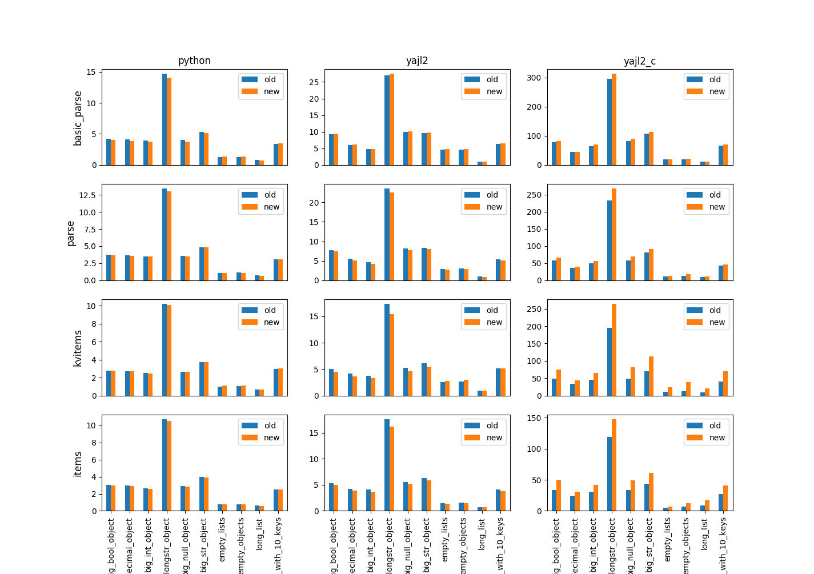

ijson design notes
##################

Version 3.0 will come with a complete re-design
of the underlying mechanism used to move data
through the different library layers.
This was done to address some limitations of the current design,
and allow more advanced use cases out of the box.

This document explains the design in ijson 2.x,
and then it shows the new design coming with ijson 3.x,
and how it offers both backward compatibility
(with no performance cost)
and new features out of the box.

2.x design (pull)
=================

ijson is a library for iterating over big (or small) JSON documents.
The main goal of the library
is to avoid loading the entire document into memory;
instead the document is iterated over in small chunks,
results are given back to the user as they are found,
and hence memory consumption stays low
throughout the whole parsing process.
This is achieved using python generators,
which naturally lend themselves to this kind of problems:
just write a ``for`` loop and ``yield`` values out of it,
and the caller can iterate over them in their own ``for`` loop.

ijson offers four modes of iterating over a JSON document,
(not long ago they were three, as ``kvitems`` was recently added),
each returning different types of results:

* ``basic_parse`` is the most basic one,
  and returns ``(event, value)`` tuples
  each time an element is found in the JSON stream
  (e.g., the beginning of an array, a object member name, etc).
* ``parse`` returns ``(prefix, event, value)`` tuples
  containing not only the information returned by ``basic_parse``,
  but also the *prefix* or *location* in the document hierarchy
  under which the event occurred.
* ``items`` returns fully-built python objects
  constructed from the contents found at a given ``prefix``.
* Finally, ``kvitems`` is similar to ``items``,
  but instead of returning full objects
  it returns ``(name, value)`` tuples
  consisting on its *members*,
  which is useful when individual objects in the JSON document
  are too big.

As a side note,
in ijson there are also different *backends*,
all of which offer the same four iteration modes.
Most of them share most of the code,
but most interestingly the ``yajl2_c`` backend doesn't,
re-implementing all the logic in C.

These four iteration modes
are all implemented as python generators.
They also have the nice property
that they are built on top of one another.
For example, ``parse`` basically works like this:

.. code-block:: python

   def parse(...):
      for event, value in basic_parse(...):
         prefix = calculate_prefix(event, value)
         yield (prefix, event, value)

All in all, the different generators are combined like this
to form a *pipeline*::

                                       +---------+
                                    ---| kvitems |
  +-------------+     +-------+    |   +---------+
  | basic_parse |-----| parse |----+
  +-------------+     +-------+    |   +---------+
                                   |---|  items  |
                                       +---------+

Now, what the diagram above doesn't show
is *who* calls *who*.
Python generators yielding values
work in a "pull" fashion:
the caller drives the execution by calling ``next(generator)``,
the generator runs
until the next ``yield`` statement is executed
and the yielded value is returned to the caller
(or until the generator exists,
in which case ``StopIteration`` is raised).
So, adding the direction of how calls are made
(including internal and external call points),
the diagram above looks like this::

                                                +---------+  next()
                                             ---| kvitems |<-------
  +-------------+  next() +-------+  next() |   +---------+
  | basic_parse |<--------| parse |<--------+
  +-------------+         +-------+         |   +---------+  next()
        ^                     ^             |---|  items  |<-------
        | next()              | next()          +---------+

The only missing bit in this diagram now is: where does data reading happen?
Because this is a pull model, the only possible solution is to do the reading
at the lowest level possible: ``basic_parse`` reads a chunk out of the JSON
stream when it is invoked for new tuples (and none are held in memory),
calculates new tuples with the parsing results,
yields them,
and eventually when there are no more contents on the stream it exits,
provoking the whole pipeline to exit
In other words, ``basic_parse`` exhausts the JSON stream,
but users drive the process
by iterating over the generator of choice until it returns.
All in all, the library works like this::

                                                                +---------+  next()
                                                             ---| kvitems |<-------
 +------+  read() +-------------+  next() +-------+  next() |   +---------+
 | file |<--------| basic_parse |<--------| parse |<--------+
 +------+         +-------------+         +-------+         |   +---------+  next()
                        ^                     ^             |---|  items  |<-------
                        | next()              | next()          +---------+

Limitations
===========

This is all well and good if you live in a blocking I/O world.
All you need to do is pass down
your blocking, file-like object
when you call ``items``, ``kvitems``, ``parse`` or ``basic_parse``,
and ijson will do the reading for you
as you iterate over the results.
However, this is also a main fundamental limitation
as it prevents users from easily using ijson in other scenarios.

One such scenario comes up when using ``asyncio``.
In an ``asyncio`` world users don't perform blocking reads anymore,
and are instead handed over chunks of data to operate on.
The only way to operate with ijson in these situations
is emulating a blocking, file-like object,
which is error-prone and not a great solution overall.

Another example in which ijson doesn't work well
would be the following:
consider a multi-stage, blocking socket-based conversation
between ``A`` and ``B``.
``A`` first receives some JSON content from ``B``,
and after parsing it it needs to reply to ``B``,
which will send more content
through the same channel of communication,
and so on.
In such case, one would need to wrap the socket
into a new object that emulates exhausting of the stream when required,
even though the underlying socket is not exhausted yet.

In both cases what we want to do
is let users *push* data into ijson rather than
having ijson *pull* data.
This is basis for the new design.

3.x design (push)
=================

In ijson 3.x we completely redesigned the parsing pipeline
to work in a push model rather than a pull model,
where chunks of data are pushed by the user into the pipeline.
This effectively decouples I/O
from the core parsing logic.
In other words, at the low level instead of working like this::

                                                                +---------+  next()
                                                             ---| kvitems |<-------
 +------+  read() +-------------+  next() +-------+  next() |   +---------+
 | file |<--------| basic_parse |<--------| parse |<--------+
 +------+         +-------------+         +-------+         |   +---------+  next()
                        ^                     ^             |---|  items  |<-------
                        | next()              | next()          +---------+

the library now works like this::

                                                  +---------+
                                              +-->| kvitems |
             +-------------+     +-------+    |   +---------+
  chunk ---->| basic_parse |---->| parse |----+
             +-------------+     +-------+    |   +---------+
                                              |-->|  items  |
                                                  +---------+

Here, ``chunk`` is a piece of data held by the user,
who sends it into ``basic_parse``,
who upon calculating a new tuple
sends it to ``parse`` and so on,
depending on what iteration mode you request.
Now the user is in full control of feeding data into the pipeline
and reacting to its results,
without the library being in charge anymore.

This is implemented using... python generators!
Generators are usually used to yield values,
but since python 2.5 they can also to *receive* values back from their callers.
This turns then effectively into "coroutines",
very much like those found in python 3.5+ ``asyncio`` coroutines
using the ``async`` and ``await`` syntax.

On that note: why didn't we use *those*?
There are at least two drawbacks to using them directly:

* Using ``asyncio`` coroutines would require users of the library
  to work within an ``asyncio`` event loop
  when interacting with ijson routines.
  As of now, that represents 0% of the current user base of ijson,
  which so far hasn't offered support for ``asyncio``
  out of the box.
  Using generator coroutines
  doesn't impose any execution context,
  giving users the freedom to use them wherever they want.
* Python 2.7 support would be removed.
  While python 2.7 is no longer maintained by the Python Software Foundation,
  there might still be programs out there using ijson with python 2.7,
  and we don't want to break them (yet).
  Using generator coroutines we maintain python 2.7 support
  in the library core.

For the rest of the text,
"coroutine" then means "plain, generator-based coroutine"
and not "python 3 ``asyncio``-based coroutine",
unless explicitly mentioned.

How do these new coroutines look like?
Firstly, they have new names
to avoid clashing with those
of the current set of generators,
and hence they all end up with a ``_basecoro`` suffix (more on this later).
Apart from this they look fairly similar
to the original generators.
For example, let's see ``basic_parse_basecoro`` and ``parse_basecoro`` in action
(this is not actual code, just a skeleton):

.. code-block:: python

   def basic_parse_basecoro(target, ...):
      while True:
         chunk = (yield)
         event, value = do_some_parsing(chunk)
         target.send((event, value))

   def parse_basecoro(target, ...):
      while True:
         event, value = (yield)
         prefix = calculate_prefix(event, value)
         target.send((prefix, event, value))

The key components are the ``(yield)`` statements,
which allow coroutines to receive data,
and the ``target.send`` calls,
which is how one sends data into a coroutine.
Moreover, we can chain them again forming a pipeline,
with data being pushed from one side,
and the appropriate events making it out on the other.
With these changes
the core pipeline now looks like this
(again including internal and external calls)::

                                                                              +------------------+ send()
                                                                          +-->| kvitems_basecoro |------->
         send() +----------------------+ send() +----------------+ send() |   +------------------+
  chunk ------->| basic_parse_basecoro |------->| parse_basecoro |--------+
                +----------------------+        +----------------+        |   +------------------+ send()
                         |                               |                |-->|  items_basecoro  |------->
                         +--> send()                     +--> send()          +------------------+

Backwards-compatibility
-----------------------

Implementing the original generators
on top of this coroutine-based pipeline
can be easily done,
thus retaining backwards-compatibility
for all users.
This is basically how ``parse`` works now:

.. code-block:: python

   def sendable_list(list):
      send = list.append

   def parse(f, ...):
      results = sendable_list()
      coro = parse_basecoro(results)
      coro = basic_parse_basecoro(parse)
      while True:
         chunk = f.read()
         coro.send(chunk)
         for result in results:
            yield result
         del results[:]
         if not chunk:
            break

Or, in other words::

                                                        parse
                   +------------------------------------------------------------------------------+
  +------+  read() |           +----------------------+ send() +----------------+ send() +------+ |  next()
  | file |<--------| chunk --->| basic_parse_basecoro |------->| parse_basecoro |------->| list | |<-------
  +------+         |           +----------------------+        +----------------+        +------+ |
                   +------------------------------------------------------------------------------+

The other generators work similarly,
with the corresponding coroutine pipeline constructed
inside each generator.

Support for asyncio
-------------------

Using this new framework,
adding support for ``asyncio`` generators
(i.e., that can be used in an ``async for`` loop)
is also trivial.
Now when running under python 3.5+
sll generators have an ``async`` counterpart
ending with an ``_async`` suffix,
which are roughly implemented like this:

.. code-block:: python

   def async_iterable(object):
      def __init__(self, f):
         self.f = f
         self.events = sendable_deque()

      async def __anext__(self):
         data = await self.f.read()
         try:
            self.coro.send(data)
         except StopIteration:
            raise StopAsyncIteration
         return self.events.pop()

   def basic_parse_async(f, ...):
      iterable = async_iterable(f)
      iterable.coro = basic_parse_basecoro(iterable.events)
      return iterable

Or, in other words::

                                                               parse_async
                         +-----------------------------------------------------------------------------------+
  +------+  await read() |        send() +----------------------+ send() +----------------+ send() +-------+ |  __anext__()
  | file |<--------------| chunk ------->| basic_parse_basecoro |------->| parse_basecoro |------->| deque | |<------------
  +------+               |               +----------------------+        +----------------+        +-------+ |
                         +-----------------------------------------------------------------------------------+

Again, the other async generators work similarly,
with the full corresponding coroutine pipeline
constructed inside the async generator.

User-facing coroutines
----------------------

Finally,
it would also make sense to offer users
access to the underlying coroutines,
with users pushing data into them,
and registering a target to receive the results.
The ``*_basecoro`` coroutines
are designed to work each on their own though,
and users would have to create them inidividually
and then chain them together manually,
which can be error prone.
Instead we also offer
"pre-chained" coroutines for each of the iterators,
which receive a chunk of data on one side,
and send out the relevant event to the user-provided coroutine.
These are called ``*_coro``
(which is why the *core* ones are called ``*_basecoro`` instead).
They are roughly implemented like this:

.. code-block:: python

   def parse_coro(target, ...):
      return basic_parse_basecoro(parse_basecoro(target), ...)

Or, in other words::

                                         parse_coro
               +-----------------------------------------------------+
        send() |  +----------------------+ send() +----------------+ | send()
 chunk --------|->| basic_parse_basecoro |------->| parse_basecoro |-|------->
               |  +----------------------+        +----------------+ |
               +-----------------------------------------------------+

The other user-facing coroutines
are constructed similarly.

Performance
===========

This is the best part:
performance is still on-par with the previous implementation,
and has even been improved as part of this exercise.

The plot below shows a comparison of processing speeds
of each generator
over three different backends
(python, yajl2 and yajl2_c)
for different synthetic test cases.
The other backends should have similar results.
For each generator/backend/test combination,
the old implementation (pure generator)
is compared to the new (coroutine-based generator).
Values are processing speeds in [MB/s],
so higher is better.

All these measurements have been made
using the ``benchmark.py`` tool
found in the git repository of ijson,
so you can give it a try as well.

These measurements were run
on an Intel(R) Core(TM) i7-5600U CPU
using python 3.7
(full results: `old.csv <./old.csv>`_, `new.csv <./new.csv>`_).
It can be seen that results vary depending on the backend,
but overall speeds are comparable
to the original implementation.
Special attention was given to the C backend,
as it was, and remains, the fastest of all,
usually by a factor of 10x.
During the porting to the new push model,
we added some modifications to its inner working
to avoid unnecessary data copies
and tuple packing/unpacking where possible,
leading to a noticeable improvement on performance
(~25% as the median).
Again, your mileage might vary
depending on the document you are parsing,
but overall these are very good results.

No proper performance comparison has been made yet
on the ``asyncio`` generators offered by ijson,
but early results suggest
there is still work to be done
to fully catch up with the generators' speed.
On the one hand,
implementing them as ``async`` generators
(which would require python 3.6+)
instead of classes with ``__aiter__`` and ``__anext__``
apparently would give a boost in speed.
Other strategies could also be investigated
for storing the temporary results
rather than keeping them in a deque.
Finally,
the C backend could see its own implementation
of the ``async`` iterables,
which will probably not be too hard.
